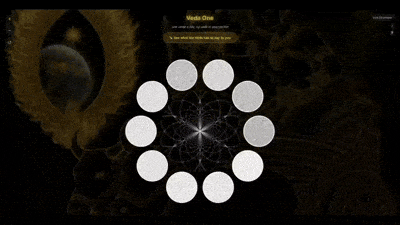

# Veda One 

### one verse a day, rig veda in your pocket

---

**Live Demo:** **[https://kirokir.github.io/veda/](https://kirokir.github.io/veda/)**  
**Submission for:** **#RigVedaHack**

---

## The Vision

Veda One offers a new dimension to the Rigveda. It presents the scripture not just as a profound text, but as a visual, interactive universe. By framing it as a source for a "verse for the day," it fosters a personal and recurring connection with the eternal wisdom.

## Judging Criteria Breakdown

### ✨ User Delight & "Wow" Factor

The "wow" factor of Veda One is delivered through four key elements working in harmony:

1.  **Visualize the Entire Rigveda:** The ability to hold all 10,552 verses—the complete scripture—in your palm and visually navigate them as a celestial structure.
2.  **Seamless Loading Transition:** The loading screen features a pulsing, circular version of the central media that perfectly matches the final visualization's size and position, creating a smooth and impressive fade-in.
3.  **Glassmorphic UI:** A modern, clean "glass" aesthetic is used for all UI elements (buttons, modals), making them feel layered and integrated with the cosmic background.
4.  **Immersive Background:** The background is a curated, Rigvedic-era depiction, subtly darkened to create a reverent atmosphere that draws the user into the experience.

### 🎨 Design

*   **Visual Clarity:** The interface is minimalist, using a "black and ash" theme with gold accents to create a high-contrast, elegant, and readable layout. The focus is kept entirely on the central mandala.
*   **Layout:** The fully responsive, mobile-first design ensures a perfect experience on any device. UI controls are dynamically positioned to prevent overlap with the visualization on smaller screens.
*   **Typography:** Professional fonts are used to ensure both readability for the interface and authenticity for the Sanskrit text.

### 👍 Usability

*   **30-Second Value:** Yes. A new user can get their "verse for the day" with a single click on the main button, delivering the core value immediately.
*   **Intuitive Onboarding:** A one-time, skippable 3-step guide explains the simple interaction model on the first visit. A `?` button allows users to re-access it at any time.
*   **Frictionless Exploration:** Interaction is natural and requires no manual: click the main button for a guided experience, or simply zoom and click any dot for self-directed discovery.

### 🚀 Performance

*   **Instant Load:** The application appears immediately with no waiting, allowing instant access to the visualization.
*   **Fluid Interactions:** Every zoom, pan, and click is designed to be smooth and seamless, creating an enjoyable and uninterrupted experience.
*   **Responsive:** The performance remains fast and fluid on both desktop and mobile devices.

### ✔️ Rigor

*   **Data Integrity:** The dataset was carefully compiled and validated to ensure all **10,552 verses** are present, leaving no gaps in the scripture.
*   **Correct Sourcing:** The application exclusively uses the unabridged **Ralph T.H. Griffith (1896) translation**, which is verifiably in the public domain and cited in the developer notes.
*   **Honest Framing:** The "Note from Dev" modal (`i` button) transparently communicates the project's development, the choice of translation, and the reasons for any potential translation gaps, fostering user trust.

### 💡 Originality

*   **Experiential Engagement:** Provides a new way to engage with the text, complementing traditional reading by encouraging spatial exploration and serendipitous discovery.
*   **The "Oracular" Twist:** The "message for the day" concept provides a fresh and compelling reason for users to engage with the ancient text daily, treating it as a source of personal guidance.

## Local Development

To run this project locally:
1.  Ensure you have Python 3 installed.
2.  Clone the repository: `git clone https://github.com/kirokir/veda.git`
3.  Navigate into the project directory: `cd veda`
4.  Start a simple web server: `python3 -m http.server`
5.  Open your browser and go to `http://localhost:8000`. 